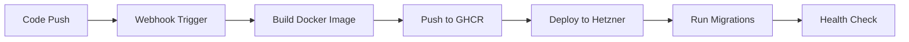

# Academy Docker - Automated Deployment for Academy LMS Stack

This repository provides an automated deployment solution for the Academy LMS stack on Hetzner Cloud. It monitors changes in the application repositories and automatically builds, pushes, and deploys updated Docker images.

## 🎯 Purpose

This is a fork of [frappe/frappe_docker](https://github.com/frappe/frappe_docker) customized to:
- Automatically deploy the Academy LMS stack with custom Frappe apps
- Monitor and react to changes in watched repositories
- Provide CI/CD pipeline for Hetzner deployment
- Integrate AI-powered tutoring capabilities via LangChain

## 📦 Components

The stack includes:

1. **[Academy LMS](https://github.com/ExarLabs/academy-lms)** - Custom fork of Frappe LMS
2. **[Academy AI Tutor Chat](https://github.com/ExarLabs/academy-ai-tutor-chat)** - AI-powered tutoring Frappe app
3. **[Academy LangChain](https://github.com/ExarLabs/academy-LangChain)** - LangChain service for AI functionality
4. **Frappe Framework** - The underlying framework
5. **Supporting Services** - MariaDB, Redis, PostgreSQL, Nginx

## 🚀 Quick Start

For detailed deployment instructions, see [DEPLOYMENT.md](DEPLOYMENT.md).

### Prerequisites

- GitHub account with access to all repositories
- Hetzner server (Ubuntu 20.04+ recommended)
- GitHub Personal Access Token
- OpenAI API key (for AI features)

### Basic Setup

1. Fork this repository
2. Configure GitHub secrets:
   - `HETZNER_SSH_KEY`
   - `ACADEMY_DOCKER_PAT`
3. Add webhook workflows to watched repositories
4. Run setup script on Hetzner server
5. Configure environment variables
6. Trigger initial deployment

## 🔄 Automated Workflow



## 📁 Repository Structure

```
academy_docker/
├── .github/workflows/       # CI/CD workflows
│   ├── deploy.yml          # Main deployment workflow
│   └── webhook-*.yml       # Webhook templates for watched repos
├── images/                 # Docker image definitions
│   └── custom/            # Custom Frappe image with apps
├── nginx/                  # Nginx configuration
├── scripts/               # Utility scripts
│   ├── migrate-all-sites.sh
│   └── setup-hetzner.sh
├── compose.yaml           # Docker Compose configuration
├── .env.example          # Environment variables template
└── DEPLOYMENT.md         # Detailed deployment guide
```

## 🔧 Configuration

Key environment variables:

- `MARIADB_ROOT_PASSWORD` - Database root password
- `ADMIN_PASSWORD` - Frappe admin password
- `OPENAI_API_KEY` - OpenAI API key for AI features
- `FRAPPE_SITE_NAME_HEADER` - Your domain name
- `LANGCHAIN_API_URL` - LangChain service URL

## 🛡️ Security

- All secrets stored in GitHub Secrets
- Firewall rules configured automatically
- SSL/TLS support for production
- Regular automated backups

## 📊 Monitoring

- Check service status: `docker compose ps`
- View logs: `docker compose logs -f`
- System health: `docker compose exec backend bench doctor`

## 🤝 Contributing

1. Fork the repository
2. Create a feature branch
3. Make your changes
4. Submit a pull request

## 📝 License

This project inherits the license from the original [frappe_docker](https://github.com/frappe/frappe_docker) repository.

## 🆘 Support

- Check [DEPLOYMENT.md](DEPLOYMENT.md) for detailed instructions
- Review GitHub Actions logs for deployment issues
- Open an issue for bugs or feature requests

---

Built with ❤️ for automated Academy LMS deployment
