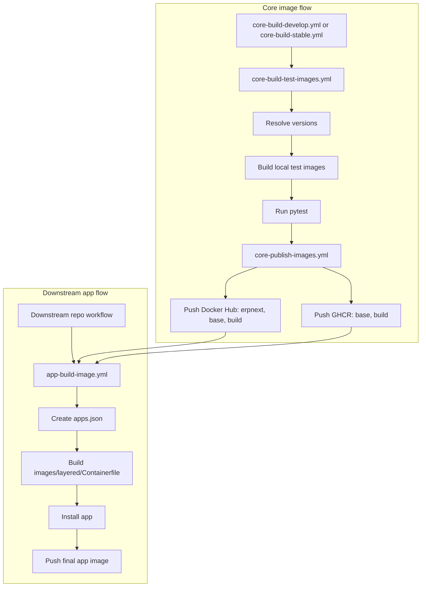

This document describes the current workflow setup for shared core images and reusable downstream app images.

# Workflow roles

The current workflow layout is:

- `.github/workflows/core-build-develop.yml`
- `.github/workflows/core-build-stable.yml`
- `.github/workflows/core-build-test-images.yml`
- `.github/workflows/core-publish-images.yml`
- `.github/workflows/app-build-image.yml`

`core-build-develop.yml` and `core-build-stable.yml` are orchestration workflows.
They decide when the core image pipeline runs.

`core-build-test-images.yml` is the reusable workflow that:

- resolves the image versions for the requested release line
- builds the shared core images into a local registry
- runs the test suite against those images

`core-publish-images.yml` is the reusable workflow that:

- publishes the tested images to Docker Hub
- publishes `base` and `build` to GHCR

`app-build-image.yml` is the reusable workflow that downstream repositories call to:

- create an `apps.json` file from the caller's app repository and ref
- build `images/layered/Containerfile`
- consume existing `base` and `build` images
- install the requested app into the final image
- optionally push the final app image to the caller's registry

# Current flow

The current structure is:

```text
core orchestration
  -> core build and test
  -> core publish

downstream app workflow
  -> consume published base and build
  -> install app
  -> publish final app image
```

Current Mermaid overview:



More concretely:

```text
core-build-test-images.yml
  -> resolves frappe and erpnext tags
  -> builds images into a local CI registry
  -> runs tests

core-publish-images.yml
  -> pushes Docker Hub: erpnext, base, build
  -> pushes GHCR: base, build

app-build-image.yml
  -> pulls:
     - <prefix>/base:<frappe_ref>
     - <prefix>/build:<frappe_ref>
  -> installs app from app_repo + app_ref
  -> pushes final image_name:image_tag
```

# Naming convention

GitHub Actions requires workflow files to stay directly inside `.github/workflows`.
Subdirectories are not supported for workflow files, so structure should come from file names and `name:` values.

Recommended file naming convention:

```text
<area>-<action>-<subject>.yml
```

Current examples:

- `core-build-bench.yml`
- `core-build-develop.yml`
- `core-build-stable.yml`
- `core-build-test-images.yml`
- `core-publish-images.yml`
- `app-build-image.yml`
- `docs-publish-site.yml`

Recommended visible workflow names:

- `Core / Build Bench`
- `Core / Build Develop`
- `Core / Build Stable`
- `Core / Build and Test Images`
- `Core / Publish Images`
- `App / Build Image`
- `Docs / Publish Site`

# Style rules

To keep workflows predictable, use one convention per category instead of mixing styles.

Workflow file names should use kebab-case:

```text
core-build-test-images.yml
app-build-image.yml
```

Workflow display names should use short title-style groups:

```text
Core / Build and Test Images
App / Build Image
```

Workflow inputs should use snake_case:

```yaml
app_name:
frappe_ref:
image_name:
```

Environment variables should use upper snake case:

```text
FRAPPE_IMAGE_PREFIX
PYTHON_VERSION
NODE_VERSION
```

The recommended rule set is:

- workflow file names: kebab-case
- workflow `name:` values: grouped title case
- workflow inputs: snake_case
- job ids and step ids: snake_case where practical
- environment variables: UPPER_SNAKE_CASE

This means `-` is preferred for file names, while `_` remains appropriate for YAML keys, inputs, and environment variables.

# Important inputs in `app-build-image.yml`

The reusable app workflow is controlled mainly by these inputs:

- `app_name`
  The application directory name, for example `crm`
- `app_repo`
  The Git repository to install, for example `frappe/crm`
- `app_ref`
  The branch or tag to install, for example `develop`
- `frappe_ref`
  The tag of the existing `base` and `build` images, for example `version-16`
- `frappe_image_prefix`
  Where the shared `base` and `build` images come from, for example `frappe` or `ghcr.io/frappe`
- `image_name`
  The final target image name, for example `ghcr.io/acme/crm`
- `image_tag`
  The final target image tag, for example `develop`
- `registry`
  The registry for the final push, for example `ghcr.io` or `docker.io`

The key distinction is:

```text
frappe_image_prefix = source of shared base/build images
image_name          = destination of the final app image
```

# Example: caller repository publishes to GHCR

This example assumes:

- shared base images exist in `ghcr.io/frappe/base` and `ghcr.io/frappe/build`
- the caller repository wants to publish its own app image to `ghcr.io/acme/crm`

```yaml
name: App / Build CRM Image

on:
  workflow_dispatch:
  push:
    branches:
      - develop

permissions:
  contents: read
  packages: write

jobs:
  build-image:
    uses: frappe/frappe_docker/.github/workflows/app-build-image.yml@main
    with:
      app_name: crm
      app_repo: acme/crm
      app_ref: develop
      frappe_ref: version-16
      frappe_image_prefix: ghcr.io/frappe
      image_name: ghcr.io/acme/crm
      image_tag: develop
      registry: ghcr.io
      push: true
      platforms: linux/amd64
```

What happens:

```text
1. app-build-image.yml is called
2. apps.json is generated from acme/crm + develop
3. the workflow builds images/layered/Containerfile
4. layered uses:
   - ghcr.io/frappe/build:version-16
   - ghcr.io/frappe/base:version-16
5. CRM is installed
6. the final image is pushed to ghcr.io/acme/crm:develop
```

For GHCR, the caller workflow should grant:

- `permissions: packages: write`

The reusable workflow then logs in with the workflow token.

# Example: caller repository publishes to Docker Hub

This example assumes:

- shared base images come from Docker Hub under `frappe`
- the caller repository wants to publish its app image to Docker Hub as `acme/crm`

```yaml
name: App / Build CRM Image

on:
  workflow_dispatch:
  push:
    branches:
      - develop

jobs:
  build-image:
    uses: frappe/frappe_docker/.github/workflows/app-build-image.yml@main
    with:
      app_name: crm
      app_repo: acme/crm
      app_ref: develop
      frappe_ref: version-16
      frappe_image_prefix: frappe
      image_name: acme/crm
      image_tag: develop
      registry: docker.io
      push: true
      platforms: linux/amd64
    secrets:
      REGISTRY_USERNAME: ${{ secrets.DOCKERHUB_USERNAME }}
      REGISTRY_PASSWORD: ${{ secrets.DOCKERHUB_TOKEN }}
```

In this case:

- shared images are pulled from `frappe/base:version-16` and `frappe/build:version-16`
- the final image is pushed to Docker Hub as `acme/crm:develop`
