# Overview

`easy-docker` is the guided terminal workflow for setting up and managing a
Frappe Docker stack from one place.

Instead of collecting Docker Compose, image build, and Bench commands manually,
you move through a small set of menus that guide the main lifecycle of a stack.

The interface is powered by `gum`, which is used to render the interactive
terminal menus and prompts.

All stack data created by the wizard is written into the repository-local
`.easy-docker` directory. That includes the generated stack environment files
and the stack-specific metadata used by the workflow.

This means `easy-docker` is not a closed system. After the setup has been
created, you can still inspect the generated files, keep working with them
manually, and continue outside the wizard if that fits your workflow better.

## What It Helps With

`easy-docker` is built to make the usual stack workflow easier to follow:

- create a new stack
- choose the stack setup path
- select apps and branches
- generate the stack environment
- build the custom image
- start, stop, restart, or delete the stack
- create and manage a site
- install or uninstall apps on the site
- create backups and run site maintenance actions

## How It Feels to Use

The workflow is organized as a guided sequence.

You start with a stack, define how it should be configured, let the wizard write
the stack files, then continue into the management area for image, runtime, and
site actions.

This makes `easy-docker` useful both for first-time setup and for returning to
an existing stack later when you need to update apps, rebuild an image, restart
services, or work on the site itself.

If you have not worked with a guided Docker setup before, it helps to think of
`easy-docker` as a step-by-step assistant. It does not ask you to memorize the
Docker commands first. Instead, it asks a small number of questions, writes the
stack configuration for you, and then gives you a menu for the most common next
actions.

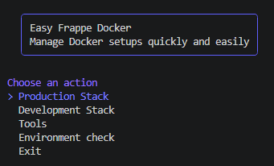

## What It Needs

To run `easy-docker`, the environment should have:

- a working `docker` CLI
- Docker Compose v2 through `docker compose`
- a running Docker daemon
- `gum` for the interactive terminal UI

When `gum` is already installed, the wizard uses it directly.

When `gum` is missing, `easy-docker` first tries to install it through the
system package manager. If that is not available or does not succeed, the
wizard can fall back to a pinned GitHub release and install `gum`
automatically when possible.

This means the usual setup flow is:

- check whether `gum` is already available
- try package-manager installation first
- use the verified fallback path only if needed
- continue into the wizard once the required tooling is ready

The Docker requirements are also checked on startup so the workflow stops early
with guidance instead of failing later in the middle of stack setup.

## Main Areas

### Stack Creation

The stack creation flow collects the main decisions up front and stores them in
the stack directory so the workflow can be resumed later.

This is where you define the stack identity, choose the setup path, and prepare
the generated configuration for the next steps.

A typical stack creation run moves through these prompts:

1. Name the stack and choose the Frappe version profile.

The stack name is simply the label under which `easy-docker` will remember this
setup. If you plan to run more than one setup later, choose a name that makes
the purpose obvious.

The Frappe version profile is the base version the stack should start from. If
you are unsure, pick the version you intend to use for the actual project or
the version your apps are built for.

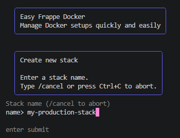

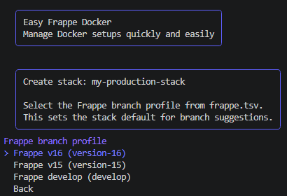

2. Choose the deployment topology and the main infrastructure options.

In this phase, the wizard asks how the stack should be structured. For most
users, this is the point where you choose the simplest practical setup and let
the wizard generate the rest of the configuration around it.

The proxy and database choices decide how traffic reaches the stack and where
the site data is stored. Even if you do not know every Docker detail yet, the
important part is that these choices describe how your stack should behave once
it is running.

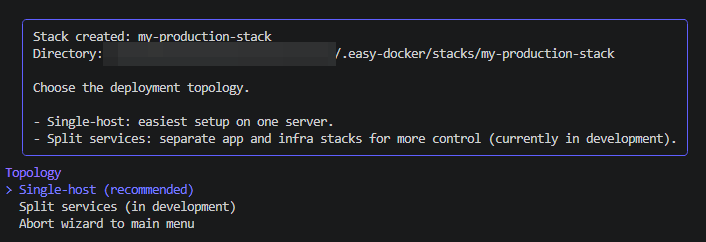

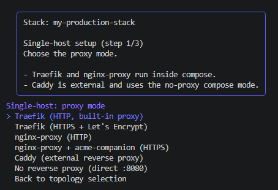

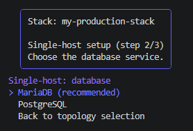

3. Define the image naming and versioning that should be used for the stack.

This step controls the image that will later be built for your stack. You can
think of it as naming the packaged application that Docker should run.

The image name identifies the image, while the image version or tag helps you
track which build you are currently using. That becomes especially useful when
you rebuild the stack after changing app branches or updating the setup.

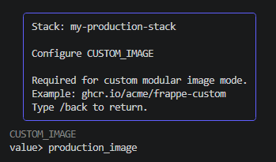

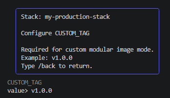

4. Select the apps and branches that should be built into the stack image.

This is the point where you decide what should actually be included in the
stack. The app selection defines the application set, and the branch selection
defines which code line of each app should be used for the build.

For new users, the practical rule is simple: only include the apps you really
need, and choose branches that match the Frappe version profile you selected
earlier.

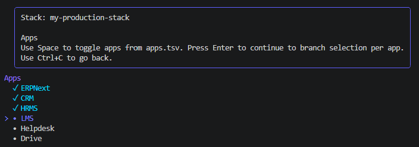

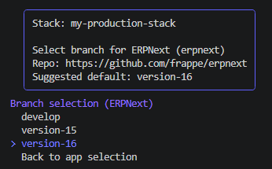

After these decisions, `easy-docker` has enough information to write the stack
files and prepare the next phase. At that point, the workflow moves from
planning the stack to actually building and running it.

### Stack Management

Once a stack exists, `easy-docker` becomes the control point for the stack:

- app selection and branch updates
- custom image build and rebuild
- Compose lifecycle actions
- site operations such as create, migrate, backup, and delete

That means the same workflow continues after setup instead of ending once the
first stack files are written.

The first management steps usually focus on preparing the image and bringing the
stack up in Docker Compose.

The build step creates the actual Docker image for the stack you just defined.
Until that image exists, there is nothing concrete for Docker Compose to start.
That is why the build action comes before the start action.

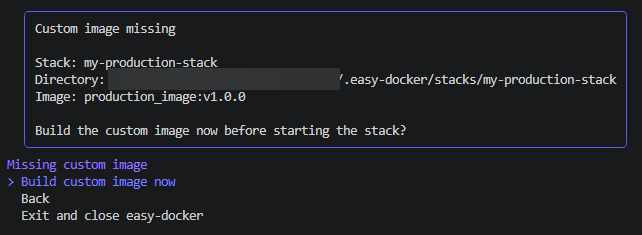

Once the image has been built successfully, you can start the stack. This tells
Docker Compose to create the containers and launch the services that belong to
your setup.

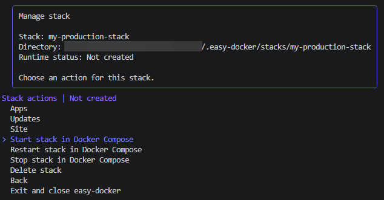

After startup, the status view helps you confirm that the stack is actually
running. This is especially useful for beginners because it gives a visible
checkpoint before moving on to site creation or later maintenance steps.

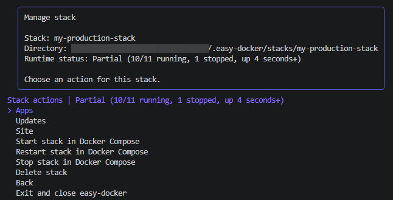

From there, the workflow usually continues into site-level actions such as
creating the first site, installing apps on the site, running migrations, or
creating backups. In other words: stack creation defines the environment, and
stack management is where that environment becomes usable.

### Development Stacks

When you create a stack through the development path, newly created sites in
that stack automatically enable `developer_mode`.

This keeps the development-specific behavior attached to the stack itself, so
the workflow stays consistent when you return to manage it later.

## Entry Point

Run the wizard from the repository root:

```bash
bash easy-docker.sh
```
