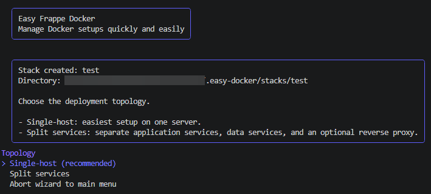
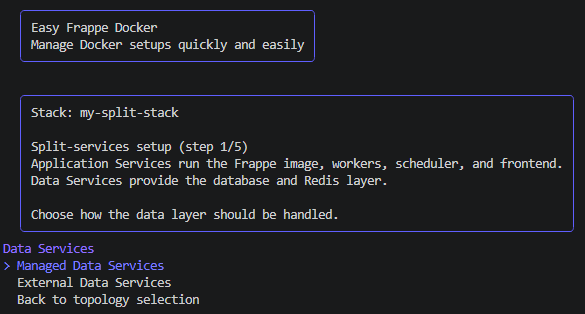
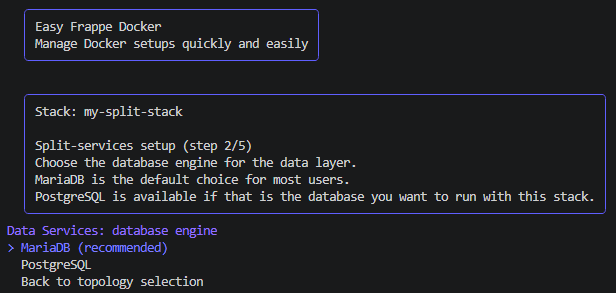
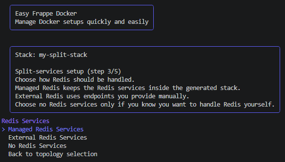
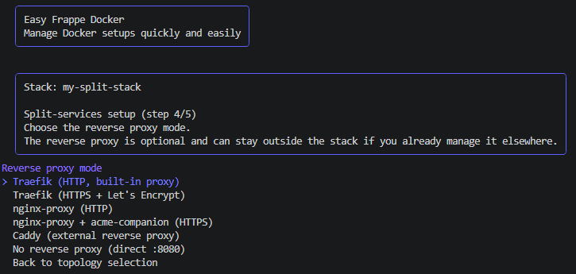
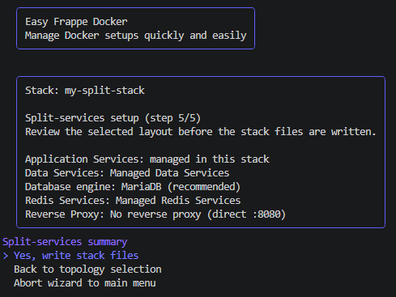
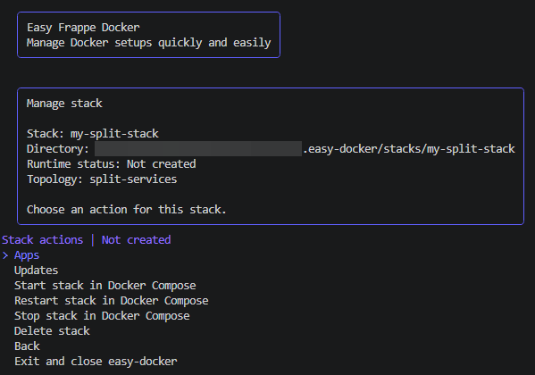

# Split Services

`split-services` is the guided setup path for users who want to keep the
application part of the stack separate from the data part, with an optional
proxy layer in front.

The goal of this page is to help a first-time user understand what each step
means and what choice they are making in the wizard.

The current split-services flow focuses on:

- writing the split stack files
- rendering the generated Compose snapshot
- building the custom image
- starting, stopping, restarting, and deleting the stack

This keeps the first version easier to understand while still making the stack
layout explicit.

Think of the split-services setup as three simple parts:

- `Application Services` run the Frappe application itself
- `Data Services` provide the database and Redis services
- `Reverse Proxy` handles incoming web traffic when you want a proxy in front

This page uses the clearer names above so the setup is easier to understand the
first time you see it.

## What This Setup Is For

Split services are useful when you do not want every service in one combined
stack.

This is a good fit if you want to:

- keep the application layer separate from the data layer
- run the database and Redis independently from the app stack
- place a proxy in front only when you actually need it
- keep the setup readable so you can manage parts of it later

If you are new to Docker, you can think of this as splitting one big stack into
smaller parts that each have a clearer job.

## How The Wizard Feels

The wizard still behaves like the other `easy-docker` flows.

It asks one question at a time, explains what that choice affects, and then
writes the stack files for you. You do not need to build the final Compose
files by hand before you start.

## Step 1. Choose The Split Topology

When you select `Split services`, the wizard first explains that the stack is
being divided into separate parts instead of using one combined setup.

At this point you are not changing any service settings yet. You are only
choosing the layout of the stack.

This matters because later steps will follow the same idea. If the setup is
split, the wizard will ask about the application side, the data side, and the
proxy side separately.

## Step 2. Decide How The Data Services Should Work

The next decision is the data layer.

This is where you decide whether `easy-docker` manages the database and Redis
for you, or whether the stack should connect to services that already exist
elsewhere.

### Managed Data Services

Choose this if you want `easy-docker` to create the database and Redis
containers as part of the generated split setup.

This is usually the easier choice when you are trying split-services for the
first time.

It means:

- the wizard writes the data service configuration for you
- the stack can start with its own managed database and Redis services
- you still keep the data layer separate from the application layer

### External Data Services

Choose this if the database and Redis are already running somewhere else.

This is more advanced, but it can be useful when:

- your organization already provides shared database and Redis services
- you want the application stack to connect to existing infrastructure
- you are splitting responsibilities across different systems

If you choose this path, the wizard asks for the required connection values and
stores them in the generated stack configuration.

## Step 3. Choose The Database Engine

After choosing how the data layer should be handled, the wizard asks which
database engine should be used for the stack.

For most users, this is the simpler way to think about it:

- `MariaDB` is the default path and usually the easiest starting point
- `PostgreSQL` is available if that is the database you already use or want to use

If the data layer is managed by `easy-docker`, this choice decides which
database service will be created in the generated setup.

If the data layer is external, this choice still matters because it tells the
stack which kind of database it is configured to connect to.

## Step 4. Decide How Redis Should Work

Redis is asked about separately so the setup stays explicit.

This is useful because some users want Redis managed together with the split
stack, while others already have Redis running elsewhere.

The choices are simple:

- `Managed Redis Services` means the stack includes Redis services for you
- `External Redis Services` means you provide the Redis endpoints yourself
- `No Redis Services` is the advanced option when you do not want the wizard to
  configure Redis for this stack

The important beginner-friendly idea is that Redis belongs to the data side of
the setup, even though it is asked in its own step.

## Step 5. Decide Whether A Proxy Should Be Included

The proxy layer is optional.

If you want the stack to answer HTTP or HTTPS traffic directly in front of the
application services, include a proxy.

If you do not need that yet, you can skip it and keep the setup simpler.

For a first-time user, the important idea is:

- the proxy is the front door
- the application services do the actual work
- the data services keep the site data and queue state safe

## Step 6. Review The Setup Before It Is Written

Before the wizard writes the files, it shows a summary of the choices you just
made.

This summary is the last chance to stop and check whether the stack is shaped
the way you expected.

The summary makes the split very obvious:

- what runs as application services
- what runs as data services
- whether a proxy is included
- whether the data services are managed by `easy-docker` or external

## What Happens After Setup

Once the split stack has been written, the generated files are stored in the
same repository-local `.easy-docker` area as the other wizard data.

That means you can still inspect the generated files later and continue working
with them manually if needed.

After the files are written, the wizard returns to the stack management view for
that split-services stack. From there you can work with the stack runtime, app
selection, and update actions that are currently supported for this topology.

For split-services, the most important practical point is that the application
side, the data side, and the proxy side remain easy to understand
individually. If you come back later to change one part, you should not have to
guess where the other parts are defined.

## A Simple Mental Model

If this is the first time you use a split setup, this is the easiest way to
think about it:

- `Application Services` are the part you interact with most often
- `Data Services` keep the database and Redis available
- `Reverse Proxy` is optional and sits in front of the application side

You do not need to understand every Docker detail before using the wizard.
You only need to know which part you want to manage separately.

## Where To Go Next

After reading this page, the next useful pages are:

- [Overview](./01-overview.md)
- [Workflows](./02-workflows.md)
- [Generated Compose](./04-generated-compose.md)
