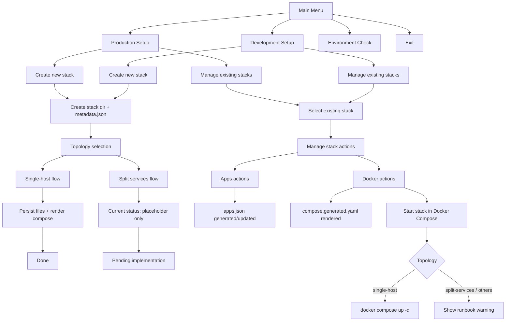
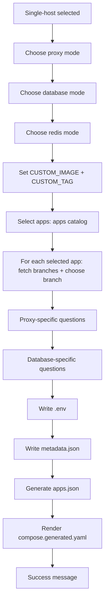

# Easy Docker Wizard Flow (Clean View)

This document shows the wizard paths in a clean, forward-only view.
Back/Cancel/Exit loops are intentionally hidden to keep the flow readable.

## 1) Main Wizard Paths

## 2) Single-host Detail Path

## 3) Notes

- This is a readability-focused flow map, not an exhaustive state machine.
- Navigation loops (Back/Cancel/Exit) are intentionally omitted.
- `Split services` remains not fully implemented in the wizard runtime.
- `Start stack in Docker Compose` currently supports only `single-host` topology.
- Site bootstrap is currently scoped to one supported site per stack.
- The site bootstrap installs the full app selection stored on the stack.
- Multiple sites in one stack with different per-site app selections are
  not supported yet and are planned for a later phase.
