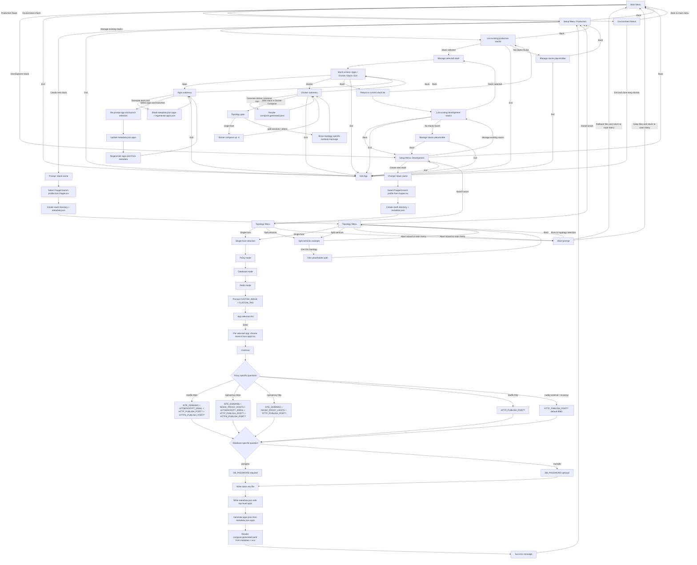

# Easy Docker Wizard Flow

## Notes

- `SITE_DOMAINS` validation accepts only domain names in form `sub.domain.tld` or `sub.sub.domain.tld`.
- Existing stack lists are filtered by `setup_type` (`production` vs `development`).
- In `Manage existing stacks`, navigation options are only `Back` and `Exit`.
- `Select apps and branches` writes app selection to top-level `apps` in `metadata.json`.
- `Generate apps.json` uses only `metadata.json -> apps` as source of truth.
- New stack wizard always uses custom image path (no separate official-vs-custom image step).
- `Start stack in Docker Compose` is currently allowed only for `single-host` topology stacks.

## Module Layout

- `lib/app/wizard/common.sh` is now a loader for common modules under `lib/app/wizard/common/`.
- `lib/app/wizard/env.sh` is now a loader for env modules under `lib/app/wizard/env/`.
- `lib/app/wizard/flows.sh` is now a loader for flow modules under `lib/app/wizard/flows/`.
- Public function names and flow behavior remain unchanged; only code organization was refactored.
